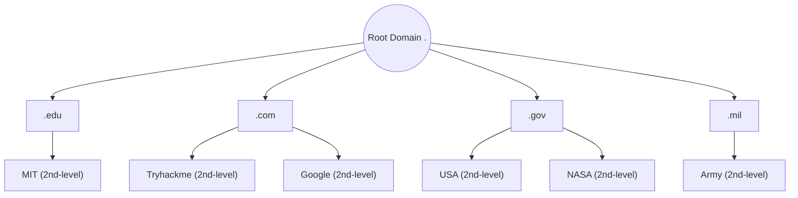
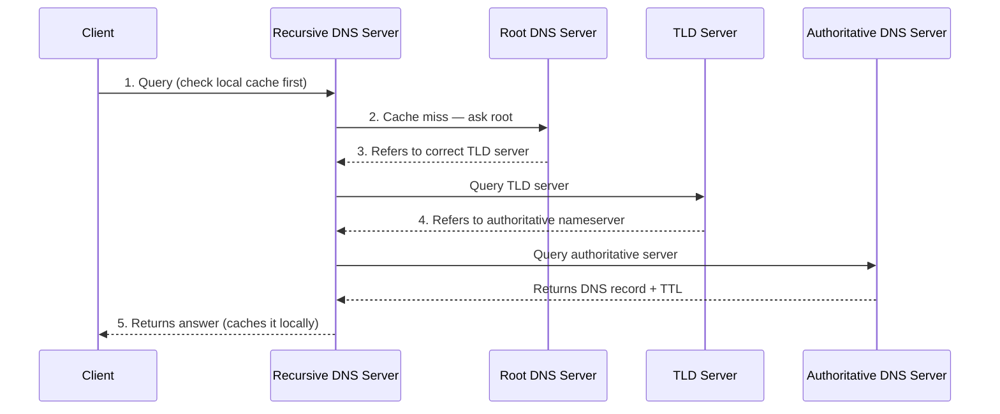

# _DNS in Detail_
_Learn how DNS works and how it helps you access internet services._

---

## Background Concepts

Before getting into DNS itself, a few underlying concepts make the rest of this easier to follow.

**IP Address**

An IP (Internet Protocol) address is a unique string of numbers assigned to every device (like a phone, computer, or router) that connects to a network or the internet; it's the actual destination DNS resolves a domain name to.

- **IPv4**: 32-bit, written as four decimal octets (0–255) separated by periods, e.g. `104.26.10.229`. ~4.3 billion possible addresses, which is why IPv6 exists.
- 
- **IPv6**: 128-bit, written as eight groups of hexadecimal digits separated by colons, e.g. `2606:4700:20::681a:be5`. Designed to solve IPv4 address exhaustion.

**TCP vs UDP**

DNS's choice of transport protocol matters for how it behaves on the network:

- **TCP (Transmission Control Protocol)**: connection-oriented, reliable protocol, ordered delivery, but higher overhead due to the three-way handshake. DNS falls back to TCP when a response is too large to fit in a single UDP packet (traditionally >512 bytes without EDNS0) or for **zone transfers** (AXFR) between DNS servers. (eg. Web browsing, emails, file transfer, and online banking where missing data causes errors.)
  
- **UDP (User Datagram Protocol)**: connectionless, no handshake, no delivery guarantee but fast, low overhead. DNS uses this by default for standard lookups because speed matters more than guaranteed delivery for a quick query/response. (eg. Live video streaming, online multiplayer gaming, and voice calls where a dropped frame matters less than a delay)

- TCP focuses on accuracy and reliable delivery, while UDP trades away those checks to maximize raw speed.
  

---

## Task 1 — What is DNS?

DNS, which stands for Domain Name System, is an application-layer protocol that runs on port 53 and primarily uses UDP for speed, falling back to TCP for large data transfers. It translates human-readable domain names into machine-readable IP addresses and vice versa, allowing network devices to locate and route traffic to internet resources. 

**Q: What does DNS stand for?**
A: Domain Name System

---

## Task 2 — Domain Hierarchy

DNS names are structured as a hierarchy, read right to left in terms of authority:

| Component | Definition | Example |
|---|---|---|
| **Root Domain** | The unnamed top of the DNS tree, represented by `.` | `.` |
| **TLD (Top-Level Domain)** | Rightmost label of a domain. Split into **gTLD** (generic — `.com`, `.org`, `.edu`, `.gov`, historically purpose-based) and **ccTLD** (country code — `.ca`, `.co.uk`, geography-based) | `.com` |
| **Second-Level Domain** | Sits directly left of the TLD. Max 63 characters + TLD; only `a-z`, `0-9`, hyphens (no leading/trailing or consecutive hyphens) | `tryhackme` in `tryhackme.com` |
| **Subdomain** | Sits left of the second-level domain, separated by a period. Same character/length rules as second-level domains (63 chars max per label); unlimited number of subdomains allowed, but full domain name capped at 253 characters | `admin` in `admin.tryhackme.com` |

**Diagram — domain hierarchy tree:**

**Q&A**
- What is the maximum length of a subdomain? **63**
- Which of the following characters cannot be used in a subdomain (`3`, `b`, `_`, `-`)? **`_`**
- What is the maximum length of a domain name? **253**
- What type of TLD is `.co.uk`? **ccTLD**

---

## Task 3 — Record Types

| Record | Resolves to | Example |
|---|---|---|
| **A** | IPv4 address | `104.26.10.229` |
| **AAAA** | IPv6 address | `2606:4700:20::681a:be5` |
| **CNAME** | Another domain name (alias) | `store.tryhackme.com` → `shops.shopify.com` |
| **MX** | Mail server(s) for the domain, with a priority value determining try-order (lower = higher priority) | `alt1.aspmx.l.google.com` |
| **TXT** | Free-text field; used for domain ownership verification, SPF/DKIM/DMARC anti-spoofing records, etc. | `"v=spf1 ip4:192.0.2.0/24 ~all"` |

**Q&A**
- What type of record would be used to advise where to send email? **MX**
- What type of record handles IPv6 addresses? **AAAA**

---

## Task 4 — Making a Request (DNS Resolution Process)

### The DNS server hierarchy

- **Recursive DNS Server**: Usually run by your ISP (or a chosen alternative like `1.1.1.1` / `8.8.8.8`). Acts on the client's behalf, doing the legwork of querying other servers and caching results locally. If it has already cached the answer, it returns it immediately — no further lookup needed.
- **Root DNS Server**: The top of the DNS hierarchy. Doesn't know the final IP — its job is to point the recursive resolver to the correct **TLD server** based on the domain's TLD (e.g. `.com`).
- **TLD Server**: Holds records pointing to the **authoritative (nameserver)** responsible for a given domain within that TLD.
- **Authoritative DNS Server (Nameserver)**: The source of truth for a domain's DNS records. This is where any DNS record updates are actually made. Domains typically have multiple nameservers for redundancy.

### Resolution flow

**TTL (Time To Live)**: every DNS record includes a TTL value, in seconds, specifying how long the record can be cached before it must be looked up again. This is what makes caching — and the "cache hit" shortcut at step 2 — possible, reducing repeated lookups for popular domains.

**Q&A**
- What field specifies how long a DNS record should be cached for? **TTL**
- What type of DNS Server is usually provided by your ISP? **Recursive DNS Server**
- What type of server holds all the records for a domain? **Authoritative DNS Server**

---

## Task 5 — Practical

**Q&A**
- CNAME of `shop.website.thm`: **shops.myshopify.com**
- TXT record value of `website.thm`: **THM{7012BBA60997F35A9516C2E16D2944FF}**
- Numerical priority value for the MX record: **30**
- IP address for the A record of `www.website.thm`: **10.10.10.10**

---

## Key Takeaways
- DNS = phonebook for the internet; port 53, UDP by default, TCP for large responses/zone transfers.
- Hierarchy: Root → TLD → Second-Level Domain → Subdomain.
- Five core record types to know cold: A, AAAA, CNAME, MX, TXT.
- Resolution path: Client (cache) → Recursive Resolver (cache) → Root → TLD → Authoritative → back down the chain, cached along the way per TTL.
