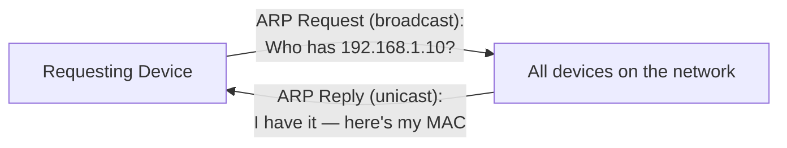
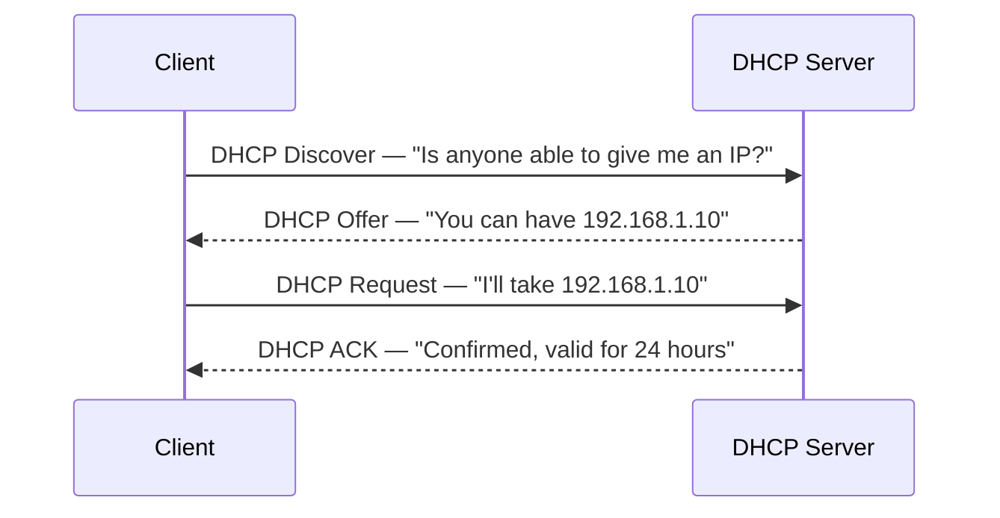

# _Intro to LAN_

Learn about some of the technologies and designs that power private networks

## Task 1: LAN Topologies

A **topology** is the design/layout of how devices in a network are physically or logically connected. Different topologies trade off cost, scalability, fault tolerance, and troubleshooting ease.

| Topology | Layout | Advantages | Disadvantages |
|---|---|---|---|
| **Star** | All devices connect individually to one central device (switch/hub) | Highly scalable. Easy to add devices; a single failed device doesn't take down the rest of the network | Most expensive (cabling + dedicated hardware); if the central device fails, **everything** connected to it goes down; more devices = more maintenance overhead |
| **Bus** | All devices share a single "backbone" cable | Cheapest and easiest to set up. Minimal cabling/hardware | Prone to slowdown/bottlenecks as traffic grows; hard to troubleshoot (all traffic shares one path); single point of failure. A broken backbone cable takes the whole network down |
| **Ring** | Devices connect directly to each other in a closed loop; data passes device-to-device around the ring | Simple to troubleshoot (data flows one direction); avoids the heavy bottlenecking seen in bus topology | Not efficient. Data may have to pass through many devices to reach its destination; one broken link/device can break the entire ring |
| **Mesh** | Every device connects directly to some or all other devices (partial vs. full mesh) | Highest redundancy and fault tolerance - multiple paths mean one failure rarely isolates a device; no single point of failure | Very expensive and complex to cable/maintain, especially at scale, a full mesh of *n* devices needs a rapidly growing number of connections |

### A note on bottlenecks
A **bottleneck** happens when too much data tries to pass through one point in the network at once, slowing everything down. The network equivalent of one narrow doorway with a crowd trying to get through. Bus topology is especially prone to this since every device shares the same single cable; star topology largely avoids it at the edges (each device has its own dedicated link) but can still bottleneck at the central switch/router if it's undersized for the traffic passing through it.

### What is a Switch?
**A switch is a networking device that connects multiple devices and forwards data based on MAC address.** It helps in efficient data transfer.
It operates at Layer 2 (Data Link layer) and keeps a table mapping which device (MAC address) is connected to which physical port. When it receives data, it forwards it *only* to the intended port rather than broadcasting it everywhere like an older hub would. This makes it far more efficient and reduces unnecessary network traffic.

### What is a Router?
**A router is a networking device that routes data packets between different networks based on IP addresses.** It operates at Layer 3 (Network layer), connecting **LAN (Local Area Network) to WAN (Wide Area Network) (Internet)** and determines the best path for data transmission.  

*The router is the boundary between the local network (LAN) and the wider Internet (WAN); the switch handles distribution within the LAN itself.*

**Q&A**
- What does LAN stand for? **Local Area Network**
- What is the verb given to the job that Routers perform? **Routing**
- What device centrally connects multiple devices and transmits data to the correct location? **Switch**
- What topology is cost-efficient to set up? **Bus Topology**
- What topology is expensive to set up and maintain? **Star Topology**
- Flag from the interactive topology-breaking lab: **THM{TOPOLOGY_FLAWS}**

---

## Task 2: A Primer on Subnetting

**Subnetting** is the process of dividing a large network into smaller, more manageable sub-networks ("subnets"). It maintains scalability and reduces the wastage of IP addresses, while also making networks easier to organize and secure — e.g. keeping an Accounting department's devices logically separate from Human Resources', even though both sit under the same overall network.

Subnetting works via a **subnet mask** — like an IP address, made up of four octets (32 bits total), each ranging 0–255. The subnet mask determines how an IP address is split into a network portion and a host portion (see the subnetting note in the *What is Networking* writeup for a worked example).

### The three address types in a subnet

| Type | Purpose | Example |
|---|---|---|
| **Network Address** | Identifies the network itself (not any specific device) | `192.168.1.0` |
| **Host Address** | Identifies an individual device within the subnet | `192.168.1.100` |
| **Default Gateway** | The device (almost always a router) responsible for forwarding traffic to *other* networks | `192.168.1.254` |

### A note on the Default Gateway
Think of the default gateway as the "exit door" of a subnet. Any traffic addressed to a device that *isn't* on the same local subnet gets sent here first, and the gateway device (typically a router) then figures out how to forward it onward — whether that's to another internal subnet or out to the Internet. Without a correctly configured default gateway, a device can talk to others on its own subnet just fine, but has no way to reach anything beyond it.

### Why subnetting matters
- **Efficiency**: avoids wasting large blocks of IP addresses on networks that don't need them.
- **Security**: separates traffic — e.g. a café's customer Wi-Fi and internal staff/register network can be fully isolated from each other while both still reach the Internet.
- **Control**: administrators can apply different rules, monitoring, or access restrictions per subnet.

**Q&A**
- Technical term for dividing a network into smaller pieces: **Subnetting**
- How many bits are in a subnet mask? **32**
- Range of a section (octet) of a subnet mask? **0–255**
- Address used to identify the start of a network? **Network address**
- Address used to identify devices within a network? **Host address**
- Device responsible for sending data to another network? **Default Gateway**

---

## Task 3 — ARP (Address Resolution Protocol)

**ARP is the technology that allows devices to identify themselves on a network by linking their MAC address (physical identifier) to their IP address (logical identifier).** Every device keeps a running log — called a **cache** — of these mappings for other devices it has recently communicated with.

### A note on cache
A **cache** is fast, temporary local storage that holds frequently or recently used data so it can be retrieved quickly without repeating the same lookup process. In ARP's case, the **ARP cache** is a local table on each device storing recent IP-to-MAC address pairings — so a device doesn't have to broadcast a new ARP request every single time it wants to talk to the same neighbor again.

### How ARP works
1. **ARP Request**: A device broadcasts a message to the *entire* network — "Who has this IP address?" — with the destination MAC address set to the broadcast address (`FF:FF:FF:FF:FF:FF`), since it doesn't yet know who it's looking for.
2. **ARP Reply**: Only the device that actually owns that IP address responds directly (unicast) with its MAC address.
3. The requesting device stores this new IP–MAC mapping in its ARP cache for future use, avoiding the need to repeat the broadcast next time.

**Q&A**
- What does ARP stand for? **Address Resolution Protocol**
- Category of ARP packet that asks whether a device has a specific IP? **Request**
- Address used as a physical identifier for a device? **MAC address**
- Address used as a logical identifier for a device? **IP address**

---

## Task 4 — DHCP (Dynamic Host Configuration Protocol)

**DHCP is a network service that automatically assigns IP addresses to devices on a network**, sparing administrators from manually configuring one on every single device. Alongside the IP address itself, DHCP typically also hands out other essential network settings — the **subnet mask**, **default gateway**, and **DNS server** to use.

> Everyday example: when your phone connects to a Wi-Fi network, DHCP is what quietly assigns it a working IP address in the background, with no manual setup needed.

### The DHCP process (DORA)
| Step | Message | Meaning |
|---|---|---|
| 1 | **Discover** | Client broadcasts: "Is anyone able to give me an IP address?" |
| 2 | **Offer** | A DHCP server responds: "You can have this IP address." |
| 3 | **Request** | Client replies: "I'll take that IP address." |
| 4 | **ACK** (Acknowledge) | Server confirms: "Confirmed — that address is yours to use for X hours." |

**Q&A**
- DHCP packet used by a device to retrieve an IP address? **DHCP Discover**
- DHCP packet sent once a device has been offered an IP? **DHCP Request**
- Final DHCP packet sent from server to device? **DHCP ACK**

---

## Key Takeaways
- Four core topologies: **Star** (scalable, expensive), **Bus** (cheap, bottleneck-prone), **Ring** (simple flow, single break kills it), **Mesh** (most redundant, most expensive).
- **Switch** = Layer 2, forwards by MAC address, connects devices within a LAN.
- **Router** = Layer 3, forwards by IP address, connects a LAN to a WAN/the Internet.
- **Subnetting** splits a network into smaller pieces for efficiency, security, and control — network address, host address, and default gateway are the three key address roles involved.
- **ARP** maps IP ↔ MAC via a broadcast Request + unicast Reply, cached locally for reuse.
- **DHCP** automates IP (and related settings) assignment via the Discover → Offer → Request → ACK exchange.

