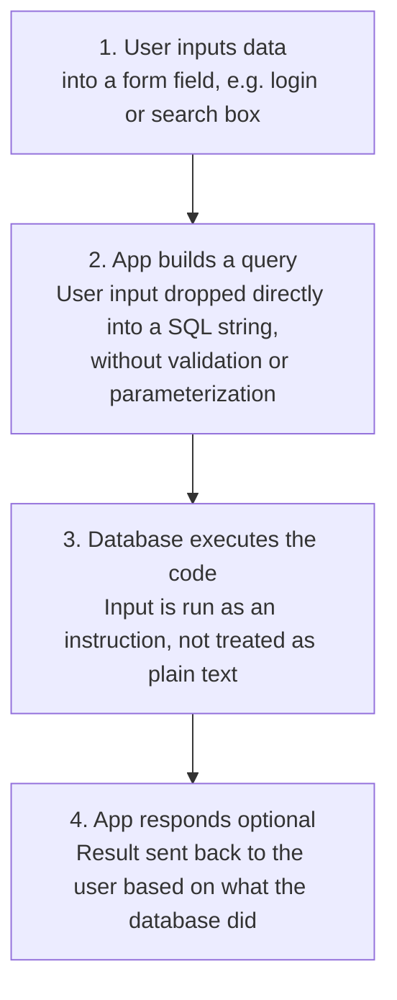
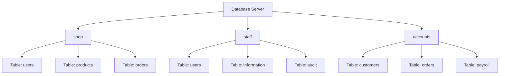
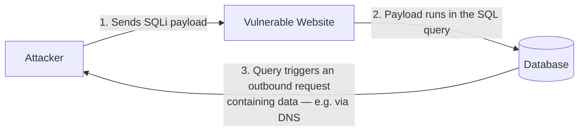

# SQL Injection Introduction

Learn how to detect and exploit SQL Injection vulnerabilities.

**_Contains both [SQL Injection](https://tryhackme.com/room/sqlinjectionlm) and [SQL Injection Introduction](https://tryhackme.com/room/sqlinjectionintroduction) rooms_**

# [SQL Injection](https://tryhackme.com/room/sqlinjectionlm) 


> Note: this covers the **SQL Injection** room. Once you've done the **SQL Injection Introduction** room, send over its content and I'll fold any new material into this same file rather than creating a duplicate.

## Task 1: Brief

**Definition:** SQL Injection (SQLi) is a web security vulnerability where an attacker inserts malicious SQL commands into input fields — such as a search bar or login box — to trick the application into running unintended database queries. It's one of the oldest web application vulnerabilities, and also one of the most damaging, since a successful attack can expose, alter, or delete an entire database.

### How it happens — the sequence of events



The vulnerability exists specifically at step 2 — the moment raw user input becomes part of the actual SQL command, rather than being treated purely as data.

### Example SQL injection queries
| Injected input | Effect |
|---|---|
| `' OR 1=1;--` | Turns a login check into an always-true condition, bypassing authentication |
| `1; DROP TABLE users;--` | Appends a destructive command to delete an entire table |
| `' UNION SELECT username, password FROM users;--` | Pulls extra data (e.g. credentials) into the page's normal output |
| `admin'--` | Comments out the rest of a query (e.g. a password check) so only the first condition matters |

**Q&A**
- What does SQL stand for? **Structured Query Language**

## Task 2: What is a Database?

**Definition:** A database is a way of electronically storing a collection of data in an organized manner. It's managed by a **DBMS (Database Management System)**, which falls into one of two categories:

### Relational databases
- Store data in structured **tables** made up of rows and columns.
- Tables can be connected via relationships using **primary keys** and **foreign keys**.
- Generally queried using **SQL**.
- Best suited to data with a clear, consistent structure.
- Examples: MySQL, PostgreSQL, Oracle, Microsoft SQL Server.

### Non-relational databases (NoSQL)
- Don't require fixed tables/rows/columns — data can be stored as documents, key-value pairs, graphs, or wide-column structures.
- Well suited to large, unstructured, or frequently-changing data.
- Examples: MongoDB, Redis, Cassandra, Neo4j.

| | Relational | Non-Relational |
|---|---|---|
| **Data structure** | Tables (rows & columns) | Documents, key-value, graphs, etc. |
| **Schema** | Usually fixed/structured | Flexible |
| **Relationships** | Strong support via keys | Usually less dependent on relationships |
| **Query language** | SQL | Varies by database |
| **Best suited for** | Structured, consistent data | Flexible or rapidly changing data |
| **Example** | MySQL | MongoDB |

**Simple example:** a college database of students, courses, and marks fits relational, since the data has clear relationships. A social media app storing varied posts, comments, and profiles often suits non-relational, since the structure varies post to post.

### Tables, columns, and rows
- A **table** is a grid: columns run left to right, rows run top to bottom.
- Each **column (field)** has a name and a data type (integer, string, date, etc.) — this prevents invalid data like text being stored where a date is expected.
- A column can be set to **auto-increment**, giving each row a unique, growing number — this is commonly used to create a **key field**, a value guaranteed unique per row, used to pinpoint exact rows in queries.
- Each **row (record)** is one individual entry in the table; adding data creates a new row, deleting data removes one.


*One database server can host multiple separate databases, each with its own set of tables.*

**Q&A**
- Acronym for the software that controls a database? **DBMS**
- Name of the grid-like structure that holds the data? **table**

---

## Task 3: What is SQL?

**Definition:** SQL (Structured Query Language) is a standardized programming language used to store, manage, and retrieve data in relational databases. SQL syntax is **not case-sensitive**, though exact syntax can vary slightly between database systems (MySQL, PostgreSQL, SQL Server, etc.) — the examples below use MySQL syntax.

### The core statements at a glance

| Statement | Purpose | Example |
|---|---|---|
| **SELECT** | Retrieve data | `SELECT * FROM users;` — all columns, all rows<br>`SELECT username, password FROM users;` — specific columns only |
| **WHERE** | Filter which rows are returned | `SELECT * FROM users WHERE username='admin';` |
| **LIKE** | Pattern match using `%` as a wildcard | `SELECT * FROM users WHERE username LIKE 'a%';` — starts with "a" |
| **LIMIT** | Restrict the number of rows returned | `SELECT * FROM users LIMIT 1;` — only the first row |
| **UNION** | Combine results from two or more SELECT statements (same column count/types/order required) | `SELECT name FROM customers UNION SELECT company FROM suppliers;` |
| **INSERT** | Add a new row | `INSERT INTO users (username, password) VALUES ('bob', 'pass123');` |
| **UPDATE** | Modify existing row(s) | `UPDATE users SET password='newpass' WHERE username='admin';` |
| **DELETE** | Remove row(s) | `DELETE FROM users WHERE username='martin';` — ⚠️ omitting the `WHERE` clause deletes *every* row |

**A few things worth remembering:**
- `WHERE ... OR ...` widens the match (either condition can be true); `WHERE ... AND ...` narrows it (both must be true).
- `LIKE '%text'` = ends with "text"; `LIKE 'text%'` = starts with "text"; `LIKE '%text%'` = contains "text" anywhere.
- `UNION`'s strict requirement — matching column count, compatible data types, same order — is exactly what makes it useful (and exploitable) for SQL injection, since it's how attackers "attach" extra data onto a legitimate query's output.

**Q&A**
- SQL statement used to retrieve data? **SELECT**
- SQL clause used to retrieve data from multiple tables? **UNION**
- SQL statement used to add data? **INSERT**

---

## Task 4: What is SQL Injection?

**Definition:** SQL injection is a web security vulnerability where an attacker inserts malicious SQL commands into input fields — such as a search bar or login box — to trick the application into running unintended database queries. (Same core definition as Task 1 — this task shows it in action.)

**Worked example:**
A blog URL like `https://website.thm/blog?id=1` likely maps to a query such as:
```sql
SELECT * FROM blog WHERE id=1 AND private=0 LIMIT 1;
```
If the `id` parameter is inserted into the query without validation, an attacker can manipulate it. Given a private article with `id=2`, requesting:
```
https://website.thm/blog?id=2;--
```
produces:
```sql
SELECT * FROM blog WHERE id=2;-- and private=0 LIMIT 1;
```
The `;` ends the SQL statement early, and `--` comments out everything after it — so the query effectively becomes `SELECT * FROM blog WHERE id=2;`, bypassing the `private=0` check entirely and exposing the private article.

### The three categories of SQL injection

| Type | How it works | Feedback to the attacker |
|---|---|---|
| **In-Band** | Attack and results travel over the *same* channel — e.g. inject on a page, see the extracted data on that same page | Direct and immediate |
| **Blind** | No visible data returned; success/failure inferred indirectly (true/false responses, or response timing) | Indirect — yes/no or timing only |
| **Out-of-Band** | Relies on a *separate* channel (e.g. a DNS or HTTP request back to an attacker-controlled server) to exfiltrate data | Delivered via a different communication channel entirely |

**Q&A**
- What character signifies the end of an SQL query? **`;`**

---

## Task 5: In-Band SQLi

**In-Band SQL Injection** is the easiest type to detect and exploit — the same channel used to send the malicious input is also used to retrieve results.

- **Error-Based**: exploits database error messages that get printed directly to the browser, often revealing enough about the database structure to enumerate it entirely.
- **Union-Based**: uses the `UNION` operator alongside a `SELECT` statement to append extra, attacker-chosen data onto the page's normal output — the most common method for extracting large amounts of data via SQLi.

**Practical summary (Level 1):** Using single-quote (`'`) probing to trigger an error confirmed the vulnerability. From there, `UNION SELECT` with an increasing number of columns (`1`, `1,2`, `1,2,3`...) was used to match the original query's column count, `database()` revealed the current database name, and `information_schema.tables` / `information_schema.columns` were queried to enumerate table and column names — eventually reaching the `staff_users` table to retrieve a password via `group_concat()`.

**Q&A**
- Flag after completing level 1: **THM{SQL_INJECTION_3840}**

---

## Task 6: Blind SQLi: Authentication Bypass

**Blind SQLi** gives little to no direct feedback about whether an injected query succeeded (error messages are disabled) — yet the injection still works underneath.

**Authentication bypass** is the simplest blind technique: rather than trying to extract data, the goal is just to make the login query evaluate to *true*. A login form typically runs a query like:
```sql
SELECT * FROM users WHERE username='%username%' AND password='%password%' LIMIT 1;
```
Entering `' OR 1=1;--` as the password turns this into:
```sql
SELECT * FROM users WHERE username='' AND password='' OR 1=1;
```
Since `1=1` is always true and it's joined with `OR`, the whole condition evaluates to true — satisfying the application's login check without ever knowing a real username/password.

**Q&A**
- Flag after completing level 2: **THM{SQL_INJECTION_9581}**

---

## Task 7: Blind SQLi: Boolean-Based

**Boolean-based SQLi** relies on a response that can only be one of two states — true/false, yes/no, 1/0. Even with just that binary signal, it's possible to enumerate an entire database character by character.

**Practical summary (Level 3):** Using an API endpoint that returned `{"taken":true/false}`, injected payloads used `UNION SELECT` combined with `LIKE` comparisons (e.g. `database() LIKE 's%'`) to test one character/guess at a time — first establishing column count, then the database name, then table names (via `information_schema.tables`), then column names (via `information_schema.columns`), and finally the actual username and password values — each confirmed one character at a time by watching the true/false flip.

**Q&A**
- Flag after completing level 3: **THM{SQL_INJECTION_1093}**

---

## Task 8: Blind SQLi: Time-Based

**Time-based SQLi** is used when there's *no* visible true/false signal at all. Instead, success is measured by how long the response takes — using a built-in delay function like `SLEEP(x)`, which only executes if the injected `UNION SELECT` was actually valid.

Example: `UNION SELECT SLEEP(5);--` — if the response is delayed by 5 seconds, the query succeeded; if not, adjust (e.g. add another column) and try again. The same enumeration process as Boolean-based SQLi applies, just using response *time* instead of a visible true/false value as the signal.

**Q&A**
- Final flag after completing level 4: **THM{SQL_INJECTION_MASTER}**

---

## Task 9: Out-of-Band SQLi

**Out-of-band SQLi** is less common, since it depends on specific database features being enabled, or on application logic that triggers an external network call based on query results. It's defined by using **two separate channels**: one to send the attack, and a completely different one to receive the results (e.g. monitoring DNS or HTTP requests hitting a server the attacker controls).



**Q&A**
- Protocol beginning with D used to exfiltrate data from a database? **DNS**

---

## Task 10: Remediation

Three main defenses against SQL injection, from most to least effective:

- **Prepared Statements (Parameterized Queries)** — *the primary defense*: write the SQL query structure first, then plug in user-supplied values as separate parameters afterward, rather than building the query as one combined string. Because the query's structure is fixed in advance, the database always knows what's a command and what's just data — user input can never be misread as part of the query itself, no matter what characters it contains.
- **Input Validation**: only accept input that matches an expected format — e.g. an allow-list of acceptable characters/patterns — rejecting or stripping anything that doesn't fit before it ever reaches the database.
- **Escaping User Input**: characters that have special meaning in SQL (like `' " $ \`) get a backslash placed in front of them, forcing the database to treat them as plain, harmless text instead of as part of the command. This is an older, weaker technique on its own — modern best practice treats it as a backup, not a replacement for prepared statements.

**Q&A**
- Name a method of protecting yourself from an SQL injection exploit: **Prepared statements**

---

## Key Takeaways
- SQLi happens when unvalidated user input becomes part of an executed SQL command, rather than staying pure data.
- Three types: **In-Band** (see results directly), **Blind** (yes/no or timing only), **Out-of-Band** (results delivered via a separate channel like DNS).
- `UNION`-based attacks require matching the target query's column count exactly — that's why column-count probing (`1`, `1,2`, `1,2,3`...) is always the first step.
- `information_schema` is the key to enumerating unknown database/table/column names once a UNION injection point is found.
- The strongest defense is **prepared statements/parameterized queries** — input validation and escaping are useful supplements, not substitutes.
